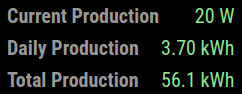

# MMM-Deye

This is a Magic Mirror Module which reads the current values from a Deye inverter in the local network.
It is currently tested with the following devices:
* SUN600G3-EU-230

Based on the code of [MMM-scrape](https://github.com/anyhow/MMM-scrape).


## Installation

Clone repository and install dependencies:
```shell
cd modules
git clone https://github.com/burberius/MMM-Deye.git
cd MMM-Deye
npm install
```

## Configuration
Add the module configuration
```javascript

    {
        module: 'MMM-Deye',
        position: 'top_left',
        config: {
                address: "192.168.1.23",
                username: "admin",
                password: "admin",
                updateInterval: 60
        }
    },

```


## Config Options

| **Option** | **Default** | **Description**                                                                 |
|------------|-----|---------------------------------------------------------------------------------|
| `address`  | `localhost` | IP or hostname of the inverter                                                  |
| `username` | `admin` | Username to log into the inverter, factory setting is `admin`
| `password` | `admin` | Password to log into the inverter, factory setting is `admin`
| `updateInterval` | 60 | Update interval in seconds, the default is to update every minute
